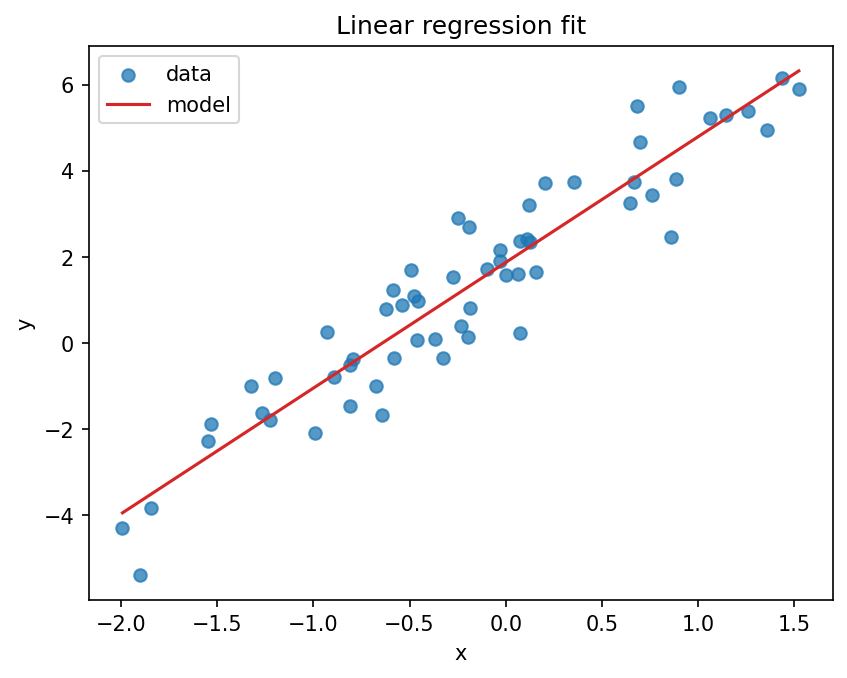
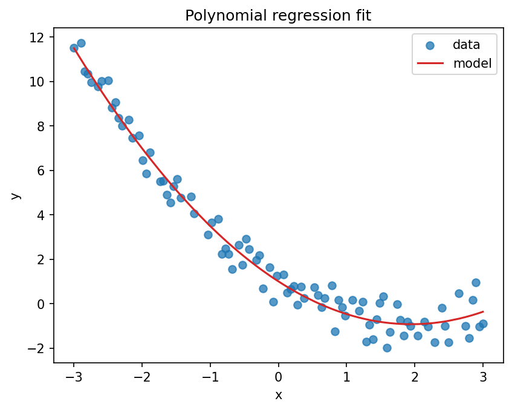
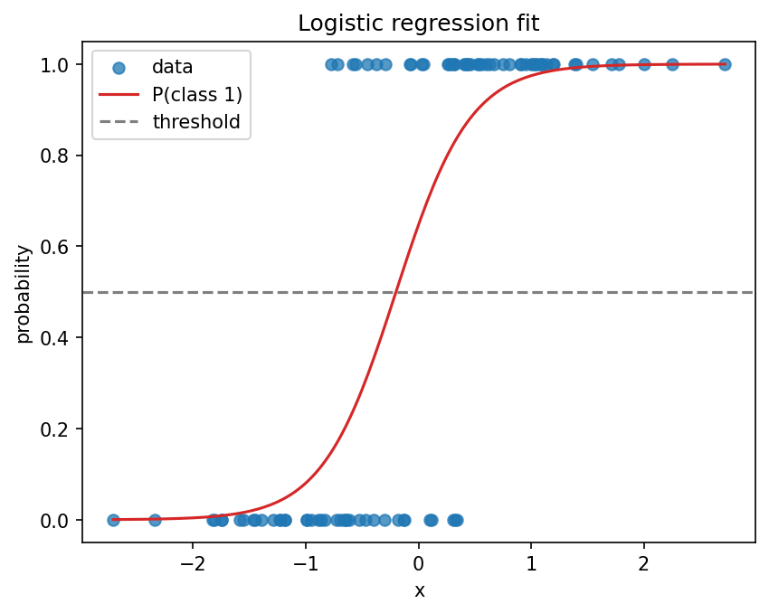
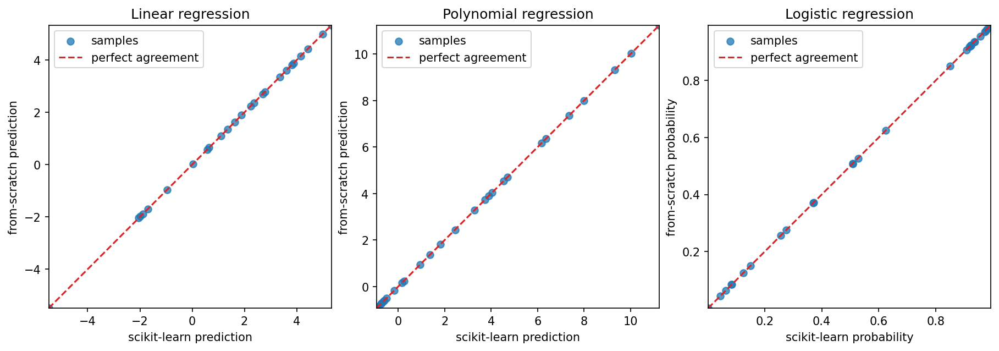

<!-- README.md - Explains the project, formulas, examples, plots, and usage.
It is the main learning guide for the repository and links code to the math.
Author: Pasquale Marzaioli
-->

# ML From Scratch

`ml_from_scratch` is a small educational machine learning project that
implements the first learning building blocks directly with NumPy.
The goal is to make the math visible: predictions, losses, gradients, train/test
splits, normalization, metrics, and plots are written explicitly instead of
hidden behind a high-level library.

## What This Project Teaches

This repository is designed for a beginner who knows basic Python and some
linear algebra, and wants to understand what a model is doing step by step.

You will learn:

- how a model turns features into predictions;
- how a loss function measures prediction error;
- how gradient descent updates weights and bias;
- why train/test splits matter;
- why feature normalization helps gradient descent;
- how polynomial features make linear regression fit curves;
- how binary logistic regression turns scores into probabilities;
- how MSE, accuracy, precision, recall, and F1 are computed;
- how a from-scratch implementation compares with scikit-learn.

The project is intentionally small. It favors readable formulas, clear shapes,
and reproducible examples over advanced features.

## Visual Overview

The example scripts generate the plots below. They are useful checks because the
model behavior should match the data geometry.

### Linear Regression

Linear regression learns a straight line. The red line is the model prediction;
the blue points are noisy synthetic data generated from a known linear pattern.



### Polynomial Regression

Polynomial regression expands one input feature into powers such as `x` and
`x^2`, then trains the same linear regression model on the expanded features.



### Logistic Regression

Binary logistic regression learns a probability curve. The dashed line is the
decision threshold: probabilities greater than or equal to `0.5` become class
`1`, and lower probabilities become class `0`.



### From-Scratch vs Scikit-Learn

The comparison script trains from-scratch and scikit-learn models on the same
synthetic data. Points near the diagonal mean the two implementations agree.



## Installation

The project uses Python 3.11 or newer.

```bash
python3 -m venv .venv
source .venv/bin/activate
pip install -e ".[dev]"
```

Optional dependencies:

```bash
pip install -e ".[comparison]"  # scikit-learn comparison script
pip install -e ".[notebooks]"   # Jupyter notebooks
```

## Quick Start

```python
import numpy as np

from ml_from_scratch import LinearRegressionGD, mean_squared_error
from ml_from_scratch.datasets import make_regression_data
from ml_from_scratch.preprocessing import (
    normalize_features,
    train_test_split,
    transform_features,
)

X, y = make_regression_data(
    n_samples=80,
    weights=np.array([3.0]),
    bias=2.0,
    noise=1.0,
    random_state=7,
)

X_train, X_test, y_train, y_test = train_test_split(
    X,
    y,
    test_size=0.25,
    random_state=7,
)

X_train_normalized, means, scales = normalize_features(X_train)
X_test_normalized = transform_features(X_test, means, scales)

model = LinearRegressionGD(learning_rate=0.01, n_iterations=1000)
model.fit(X_train_normalized, y_train)

predictions = model.predict(X_test_normalized)
test_mse = mean_squared_error(y_test, predictions)

print(test_mse)
```

## Shape Conventions

The code uses one set of shapes everywhere:

```text
X: shape (n_samples, n_features)
y: shape (n_samples,)
weights: shape (n_features,)
bias: scalar
predictions: shape (n_samples,)
```

These conventions make the NumPy formulas readable:

```python
predictions = X @ weights + bias
```

## Linear Regression

Linear regression predicts a numeric target with a weighted sum of input
features plus a bias:

```text
y_hat = X @ w + b
```

The loss is mean squared error:

```text
loss = mean((y_hat - y) ** 2)
```

The gradients for `n` samples are:

```text
errors = y_hat - y
dL/dw = (2 / n) * X.T @ errors
dL/db = (2 / n) * sum(errors)
```

Gradient descent updates the parameters in the opposite direction of the
gradient:

```text
w = w - learning_rate * dL/dw
b = b - learning_rate * dL/db
```

Implementation:

- [src/ml_from_scratch/linear_regression.py](src/ml_from_scratch/linear_regression.py)
- [tests/test_linear_regression.py](tests/test_linear_regression.py)
- [notebooks/01_linear_regression.ipynb](notebooks/01_linear_regression.ipynb)

## Polynomial Regression

Polynomial regression is implemented by feature expansion. For one input column
`x` and degree `3`, the expanded row is:

```text
[x, x^2, x^3]
```

The prediction becomes:

```text
y_hat = b + w1*x + w2*x^2 + w3*x^3
```

This is still linear in the learned parameters because the model learns
`w1`, `w2`, `w3`, and `b`. The powers of `x` are fixed input features created
before training.

Implementation:

- [src/ml_from_scratch/preprocessing.py](src/ml_from_scratch/preprocessing.py)
- [scripts/train_polynomial.py](scripts/train_polynomial.py)
- [notebooks/03_overfitting.ipynb](notebooks/03_overfitting.ipynb)

## Logistic Regression

Logistic regression is used here for binary classification. It starts with the
same linear score as linear regression:

```text
z = X @ w + b
```

Then it maps the score to a probability with the sigmoid function:

```text
p = sigmoid(z) = 1 / (1 + exp(-z))
```

The loss is binary cross-entropy:

```text
loss = -mean(y * log(p) + (1 - y) * log(1 - p))
```

For sigmoid output and binary cross-entropy, the gradients simplify to:

```text
errors = p - y
dL/dw = (1 / n) * X.T @ errors
dL/db = (1 / n) * sum(errors)
```

Prediction uses a threshold:

```text
p >= 0.5 -> class 1
p < 0.5  -> class 0
```

Implementation:

- [src/ml_from_scratch/logistic_regression.py](src/ml_from_scratch/logistic_regression.py)
- [tests/test_logistic_regression.py](tests/test_logistic_regression.py)
- [notebooks/02_logistic_regression.ipynb](notebooks/02_logistic_regression.ipynb)

## Preprocessing

### Train/Test Split

The train/test split separates data used for learning from data used for
evaluation. This matters because a model can fit the training data well and
still behave poorly on unseen data.

```python
X_train, X_test, y_train, y_test = train_test_split(
    X,
    y,
    test_size=0.25,
    random_state=7,
)
```

### Feature Normalization

Gradient descent is easier to tune when features have similar scales. The
normalization helper computes training statistics:

```text
X_normalized = (X - mean) / standard_deviation
```

The same `mean` and `standard_deviation` must be reused for test data. This
prevents information from the test set leaking into training.

```python
X_train_normalized, means, scales = normalize_features(X_train)
X_test_normalized = transform_features(X_test, means, scales)
```

Constant features are handled by replacing a zero scale with `1.0`, which turns
the constant column into zeros after normalization.

## Metrics

### Mean Squared Error

Mean squared error measures average squared prediction error:

```text
MSE = mean((y_pred - y_true) ** 2)
```

It is used for regression.

### Accuracy

Accuracy is the fraction of correct labels:

```text
accuracy = correct_predictions / total_predictions
```

### Precision

Precision answers: when the model predicts class `1`, how often is it right?

```text
precision = true_positives / (true_positives + false_positives)
```

### Recall

Recall answers: out of all real class `1` examples, how many did the model
find?

```text
recall = true_positives / (true_positives + false_negatives)
```

### F1

F1 combines precision and recall:

```text
F1 = 2 * precision * recall / (precision + recall)
```

When a denominator is zero, these metric functions return `0.0`.

Implementation:

- [src/ml_from_scratch/metrics.py](src/ml_from_scratch/metrics.py)
- [tests/test_metrics.py](tests/test_metrics.py)

## Synthetic Datasets

The dataset helpers create small reproducible datasets for examples, tests, and
notebooks.

```python
import numpy as np

from ml_from_scratch.datasets import (
    make_binary_classification_data,
    make_polynomial_regression_data,
    make_regression_data,
)

X_linear, y_linear = make_regression_data(
    n_samples=100,
    weights=np.array([3.0]),
    bias=2.0,
    noise=1.0,
    random_state=7,
)

X_polynomial, y_polynomial = make_polynomial_regression_data(
    n_samples=120,
    degree=2,
    coefficients=np.array([1.0, -2.0, 0.5]),
    noise=0.6,
    random_state=11,
)

X_binary, y_binary = make_binary_classification_data(
    n_samples=120,
    weights=np.array([1.0]),
    noise=0.6,
    random_state=19,
)
```

`random_state` makes the output reproducible. That is important for learning
because the same code should produce the same data, model behavior, tests, and
plots.

## Example Scripts

Run the scripts from the repository root:

```bash
python scripts/train_linear.py
python scripts/train_polynomial.py
python scripts/train_logistic.py
```

If your shell does not provide `python`, use:

```bash
python3 scripts/train_linear.py
python3 scripts/train_polynomial.py
python3 scripts/train_logistic.py
```

The scripts print learned values and save plots under `plots/`.

Example output for linear regression:

```text
raw-scale weight: 2.920
raw-scale bias: 1.868
test MSE: 0.818
saved plots to: plots
```

Example output for polynomial regression:

```text
degree: 2
raw-scale bias: 0.999
raw-scale x^1 weight: -1.977
raw-scale x^2 weight: 0.507
test MSE: 0.245
saved plots to: plots
```

Example output for logistic regression:

```text
final loss: 0.313
train accuracy: 0.833
test accuracy: 0.867
test precision: 0.789
test recall: 1.000
test F1: 0.882
saved plots to: plots
```

## Compare With Scikit-Learn

Scikit-learn is used only for comparison scripts, not for the core
implementation.

Install the optional dependency:

```bash
pip install -e ".[comparison]"
```

Run:

```bash
python scripts/compare_sklearn.py
```

The script trains equivalent from-scratch and scikit-learn models on the same
synthetic datasets, train/test splits, and normalized features.

Example output:

```text
Linear regression
from-scratch MSE: 0.751
scikit-learn MSE: 0.751

Polynomial regression
from-scratch MSE: 0.245
scikit-learn MSE: 0.245

Logistic regression
from-scratch accuracy: 0.867
scikit-learn accuracy: 0.867
mean absolute probability difference: 0.000
```

For logistic regression, scikit-learn regularization is disabled so the library
model is closer to the from-scratch objective.

## Notebooks

Install the optional notebook tools:

```bash
pip install -e ".[notebooks]"
jupyter lab notebooks
```

Notebook guide:

- [01_linear_regression.ipynb](notebooks/01_linear_regression.ipynb): linear
  regression, MSE, gradient descent, normalization, and fit diagnostics.
- [02_logistic_regression.ipynb](notebooks/02_logistic_regression.ipynb):
  sigmoid probabilities, binary cross-entropy, thresholding, and metrics.
- [03_overfitting.ipynb](notebooks/03_overfitting.ipynb): polynomial features,
  underfitting, overfitting, and test error.

Execute one notebook from the terminal:

```bash
jupyter execute --kernel_name=python3 notebooks/01_linear_regression.ipynb
```

## Public API

```python
from ml_from_scratch import (
    LinearRegressionGD,
    LogisticRegressionGD,
    accuracy_score,
    binary_cross_entropy_loss,
    f1_score,
    make_binary_classification_data,
    make_polynomial_regression_data,
    make_regression_data,
    mean_squared_error,
    normalize_features,
    polynomial_features,
    precision_score,
    recall_score,
    sigmoid,
    train_test_split,
    transform_features,
)
```

Model classes expose:

```python
model.fit(X_train, y_train)
model.predict(X_test)
model.score(X_test, y_test)
```

`LogisticRegressionGD` also exposes:

```python
model.predict_proba(X_test)
```

## Testing And Quality Checks

Run the full test suite:

```bash
pytest
```

Run linting:

```bash
ruff check .
```

Check formatting:

```bash
ruff format --check .
```

The test suite covers:

- prediction shapes;
- loss decrease during training;
- hand-checkable gradient behavior;
- metric values on known inputs;
- normalization behavior, including constant features;
- train/test split size and row alignment;
- synthetic dataset reproducibility;
- plotting helper behavior.

## Design Choices

- NumPy is used for numerical computation.
- Matplotlib is used for plots.
- Scikit-learn is limited to comparison scripts.
- The core implementation does not use hidden estimators or solvers.
- Gradient descent is kept inside the model classes so the learning loop is
  visible next to the formulas it implements.
- Polynomial regression is implemented as explicit feature expansion followed
  by linear regression.
- Input validation is strict so shape mistakes fail early with clear messages.

## Out Of Scope

The following topics are intentionally outside the current scope:

- multi-class classification;
- advanced classification metrics such as ROC curves and AUC;
- neural networks;
- regularization;
- stochastic and mini-batch gradient descent;
- production-grade model serialization or deployment.

These topics are valuable, but they add concepts that would distract from the
first goal: understanding supervised learning fundamentals from simple NumPy
code.

## License

Copyright (c) 2026 Pasquale Marzaioli

This project is released under the MIT License. See [LICENSE](LICENSE).
